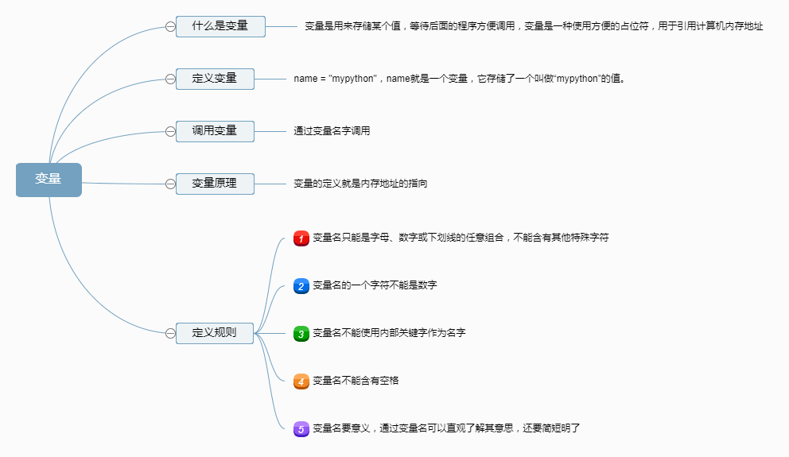

# 变量

​	为了提高开发效率，我们建议使用pycharm等开发工具，进行开发工作。

## 一、什么是变量

​	在计算机程序处理的数据必须放入内存，变量就是用来引用内存中某个值，方便后面程序的使用，即变量指向内存中数据对象的地址。


## 二、如何声明变量

格式：

​	**变量名 = 要赋的值**

```python
name = "mypython"
# 这就是声明了一个变量name
```


## 三、变量的调用

如果要在程序中调用某一个变量，直接使用其变量名即可：

```python
name = 'zhanghk'
print("My name is ,",name)

# 输出结果

My name is zhanghk
```


## 四、变量原理

​	变量的原理就是通过变量名字指向变量值所在的内存地址，也就是对数据内存地址的引用


## 五、变量的命名规则

* 第一个字符必须是字母、下划线（“_”），其后的字符可以是字母、下划线或数字。
* 不能使用Python语言保留的关键字，如if，for等
* 变量名要简短，且有意义


##六、Python语言遵循的命名规则


| **类型** |                   命名规则                   |       举例        |
| :----: | :--------------------------------------: | :-------------: |
| 模块/包名  |         全小写字母，简单有意义，如果需要可以使用下划线          |    math、sys     |
|  函数名   |            全小写字母，可以使用下划线增加阅读性            | foo()、my_func() |
|  变量名   |            全小写字母，可以使用下划线增加阅读性            |   age、my_car    |
|   类名   | 采用PascalCase命名规则，即多个单词组成名称，每个单词除第一个字母大写外，其余的字母均小写 |     MyClass     |
|  常量名   |            全大写字母，可以使用下划线增加阅读性            |  LEFT、TAX_RATE  |


# 

***附：变量知识点图解***

****