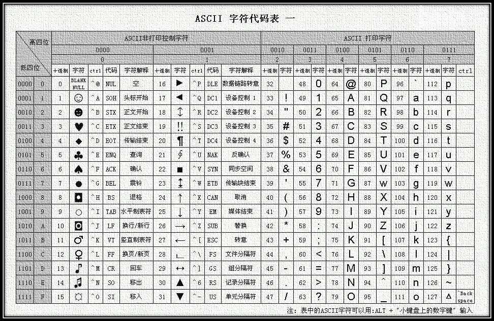
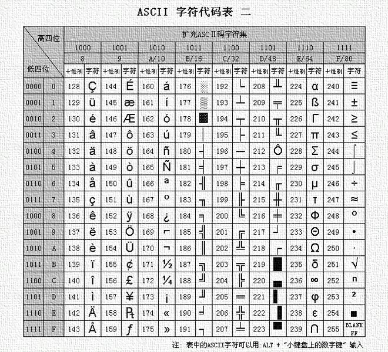
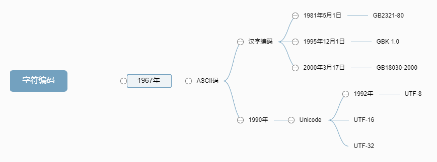

# 二进制与字符编码


## 一、二进制

​	计算机是由逻辑电路组成，逻辑电路通常只有两个状态，开关的接通与断开，这两种状态正好可以用“1”和“0”表示。

​	所谓二进制，也就是计算机运算时用的一种算法。二进制只由一和零组成。即是逢二进一，二进制广泛用于最基础的运算方式，计算机的运行计算基础就是基于二进制来运行。只是用二进制执行运算，用其他进制表现出来。


## 二、字符编码

### 1、ASCII

​	ASCII（American Standard Code for Information Interchange，美国信息交换标准代码）是基于拉丁字母的一套电脑编码系统，主要用于显示现代英语和其他西欧语言。

#### 	ASCII产生

​	在计算机中，所有的数据在存储和运算时都要使用二进制数表示（因为计算机用高电平和低电平分别表示1和0），例如，像a、b、c、d这样的52个字母（包括大写）、以及0、1等数字还有一些常用的符号（例如*、#、@等）在计算机中存储时也要使用二进制数来表示，而具体用哪些二进制数字表示哪个符号，当然每个人都可以约定自己的一套（这就叫编码），而大家如果要想互相通信而不造成混乱，那么大家就必须使用相同的编码规则，于是美国有关的标准化组织就出台了ASCII编码，统一规定了上述常用符号用哪些二进制数来表示。每个字节站8个比特位。

​	ASCII码一共有256个字符，其中前128个字符是常用字符。一般需要记住几个重要的，比如：space（空格）是32，0是48，A是65，a是97。这几个经常会用到。后来又增加了128个扩展编码，即扩展ASCII码，用于扩展特殊字符和外来字母及图形符号等。

**ASCII 字符代码表 一**




**ASCII 字符代码表 二**




### 2、汉字编码

​	0-127 是7位ASCII 码的范围，是国际标准。

​	至于汉字，不同的字符集用的ascii 码的范围也不一样，常用的汉字字符集有GB2312-80,GBK,Big5,unicode 等。

​	1981年5月1日开始实施的一套国家标准，标准号是GB 2312—1980。GB2312-80字符集适用于汉字处理、汉字通信等系统之间的信息交换，通行于中国大陆、新加坡等地也采用此编码。中国大陆几乎所有的中文系统和国际化的软件都支持GB 2312。

​	GB 2312标准共收录6763个汉字，其中一级汉字3755个，二级汉字3008个；同时，GB 2312收录了包括拉丁字母、希腊字母、日文平假名及片假名字母、俄语西里尔字母在内的682个全角字符。GB 2312的出现，基本满足了汉字的计算机处理需要，它所收录的汉字已经覆盖中国大陆99.75%的使用频率。GB2312 字符集是目前最常用的汉字编码标准。

​	对于人名、古汉语等方面出现的罕用字，GB 2312不能处理，这导致了后来GBK及GB 18030汉字字符集的出现。

​	1995年12月1日，中华人民共和国全国信息技术标准化技术委员会制订GBK 1.0 编码，是在GB2312-80标准基础上的内码扩展规范，使用了双字节编码方案，其编码范围从8140至FEFE（剔除xx7F），共23940个码位，共收录了21003个汉字，完全兼容GB2312-80标准，支持国际标准ISO/IEC10646-1和国家标准GB13000-1中的全部中日韩汉字，并包含了BIG5编码中的所有汉字。GBK编码方案于1995年10月制定， 1995年12月正式发布，目前中文版的WIN95、WIN98、WINDOWS NT以及WINDOWS 2000、WINDOWS XP、WIN 7等都支持GBK编码方案。

​	2000年 3月17日信息产业部和国家质量技术监督局联合发布GB18030，其中包含两个版本：GB18030-2000和GB18030-2005。GB18030-2000是GBK的取代版本，它的主要特点是在GBK基础上增加了CJK统一汉字扩充A的汉字。GB18030-2005的主要特点是在GB18030-2000基础上增加了CJK统一汉字扩充B的汉字。

​	GB 18030-2000收录了27533个汉字，GB 18030-2005收录了70244个汉字。GB18030的总编码空间超过150万个码位，为解决人名、地名用字问题提供了方案，为汉字研究、古籍整理等领域提供了统一的信息平台基础。


### 3、Unicode

​	Unicode（统一码、万国码、单一码）是计算机科学领域里的一项业界标准,包括字符集、编码方案等。Unicode 是为了解决传统的字符编码方案的局限而产生的，它为每种语言中的每个字符设定了统一并且唯一的二进制编码，以满足跨语言、跨平台进行文本转换、处理的要求。1990年开始研发，1994年正式公布。

​	Unicode是国际组织制定的可以容纳世界上所有文字和符号的字符编码方案。目前的Unicode字符分为17组编排，0x0000 至 0xFFFF，每组称为平面（Plane），而每平面拥有65536个码位，共1114112个。然而目前只用了少数平面。UTF-8、UTF-16、UTF-32都是将数字转换到程序数据的编码方案。

​	UTF-8（8-bit Unicode Transformation Format）是一种针对Unicode的可变长度字符编码，又称万国码。


### 附：字符编码发展历史




## 三、Python字符编码

​	在python 2.x中默认不支持中文，需要在文件头第一行或第二行声明文件处理的编码格式：

```python
# -*- coding:utf-8 -*-
```

​	在python 3.x默认支持的编码格式是UTF-8，也就是说，文件不需要提前声明编码格式，就可以直接使用中文字符。

```python
msg = "你好，世界！"
print(msg)

# 输出结果

你好，世界！
```

