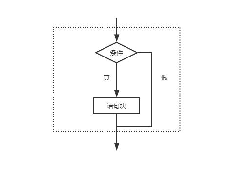
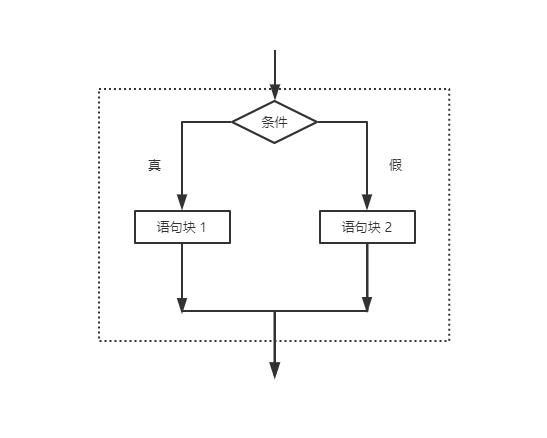
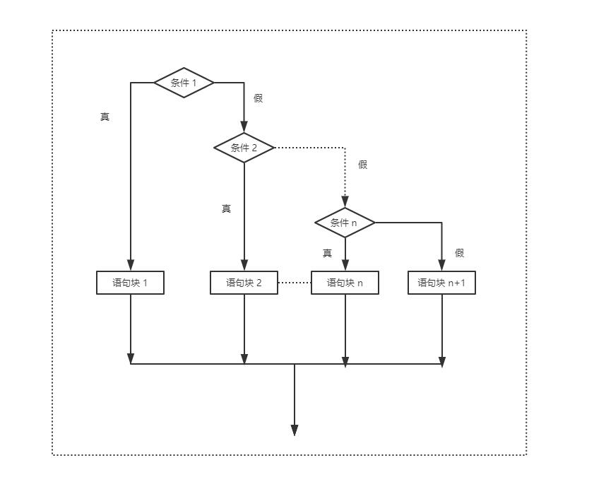

# if语法

>分支结构，根据条件来控制代码的执行分支的结构。在python中使用if语句来实现分支结构。

### 一、单分支

​	if语句的语法格式：

​	***if (条件表达式):***

​		***语句/语句块***

​	（1）**条件表达式**可以是关系表达式、逻辑表达式、算数表达式等。

​	（2）**语句/语句块**可以是单个语句，也可以是多个语句。

​	当条件表达式的值为真时，执行if后的语句（块），否则不做任何操作，流程图：



```python
username = 'john'
password = '123@pwd'

user = input("your user name ?")
passwd = input("your password ?")

if user == username and passwd == password:
    print("欢迎登录！")

```

​	输出

```powershell
your user name ?john
your password ?123@pwd
欢迎登录！
```

## 

### 二、双分支

​	if语句的语法形式：

​	***if(条件表达式):***

​		***语句/语句块1***

​	***else:***

​		***语句/语句块2***

​	当条件表达式的值为真时，执行if后的语句（块）1，否则执行else后的语句（块）2，流程图：



```python
username = 'john'
password = '123@pwd'

user = input("your user name ?")
passwd = input("your password ?")

if user == username and passwd == password:
    print("欢迎登录！")
else:
    print("抱歉！登录失败！")
```

​	输出

```powershell
your user name ?zhanghk
your password ?123456
抱歉！登录失败！
```

## 


### 三、多分支

​	if语句的语法结构形式：

​	***if(条件表达式1):***

​		***语句/语句块1***

​	***elif(条件表达式2):***

​		***语句/语句块2***

​	**...**

​	***elif(条件表达式n):***

​		***语句/语句块 n***

​	***[else:***

​		***语句/语句块 n+1]***

​	根据不同条件表达式的值来决定执行哪个语句（块），流程图：




```python
number = 40

guess_number = int(input("your guess number ?"))

if guess_number > number:
    print("your guess bigger!")
elif guess_number < number:
    print("your guess smaller")
else:
    print("your get it!")
```

