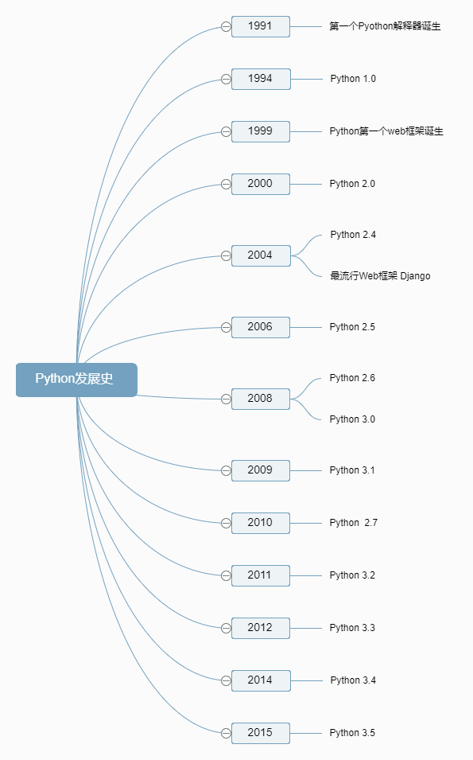

# Python 是什么语言？

#### 编程语言分类：

>- 解释型语言和编译型语言
>- 静态类型语言和动态类型语言
>- 强类型定义语言和弱类型定义语言

## 一、解释型语言和编译型语言

* #### 解释型语言

​        相对于编译型语言存在的，源代码不是直接翻译成机器语言，而是先翻译成中间代码，再由解释器对中间代码进行解释运行。比如Python/JavaScript / Perl /Shell等都是解释型语言。

​	程序不需要编译，程序在运行时才翻译成机器语言，每执 行一次都要翻译一次。

* #### 编译型语言

​        程序在执行之前需要一个专门的编译过程，把程序编译成 为机器语言的文件，运行时不需要重新翻译，直接使用[编译](http://baike.baidu.com/item/%E7%BC%96%E8%AF%91)的结果就行了。程序执行效率高，依赖编译器，跨平台性差些。如C、C++、Delphi等.


## 二、静态类型语言和动态类型语言

* #### 静态语言

​        静态类型语言的类型判断是在运行前判断（如编译阶段），比如C#、java就是静态类型语言，静态类型语言为了达到多态会采取一些类型鉴别手段，如继承、接口，

* #### 动态语言

​        所谓的动态类型语言，意思就是类型的检查是在运行时做的，比如如下代码是不是合法的要到运行时才判断（注意是运行时的类型判断）：

```python
def sum(a, b):
    return a + b
```

## 三、强类型定义语言和弱类型定义语言

* #### 强类型定义语言

​        强类型语言也称为强类型定义语言。是一种总是强制类型定义的语言，要求变量的使用要严格符合定义，所有变量都必须先定义后使用。

​        java、.NET、C++、python等都是强制类型定义的。也就是说，一旦一个变量被指定了某个数据类型，如果不经过强制转换，那么它就永远是这个数据类型了。

* #### 弱类型定义语言

​        弱类型语言也称为弱类型定义语言。与强类型定义语言相反。像vb，php等就属于弱类型语言。


## 四、Python

>#### Python is a programming language that lets you work more quickly and integrate your systems more effectively.
>
>Python是一种编程语言，它能让您更快地工作并更有效地集成系统。
>
>Python is powerful... and fast; 
>plays well with others; 
>runs everywhere; 
>is friendly & easy to learn; 
>is Open.
>
>python是强大的…快速；
>与他语言相处得好；
>任何地方都可以运行；
>友好而且易于学习；
>开源的。

​	Python是一种高级，解释，交互和面向对象的脚本语言。Python被设计为高度可读性。它会频繁使用英文关键字，因为其他语言使用标点符号，而且语法结构比其他语言少。

* **Python解释：** Python在解释器的运行时处理。执行前不需要编译程序。这与PERL和PHP类似。
* **Python是互动的：**你可以在Python提示符下，直接与程序接口进行交互来编写程序。
* **Python是面向对象的：** Python支持面向对象的风格或编程技术，将对象内的代码封装起来。
* **Python是初学者语言：** Python是初学者程序员的一种很好的语言，并支持从简单的文本处理到互联网再到游戏开发等各种应用程序。

## Python历史

​        Python由Guido van Rossum在八十年代末期和九十年代初在荷兰的数学与计算机科学研究所开发。

​        Python源自许多其他语言，包括ABC，Modula-3，C，C ++，Algol-68，SmallTalk和Unix shell以及其他脚本语言。

​        Python受版权保护。像Perl一样，Python源代码现在可以在GNU通用公共许可证（GPL）下使用。

​        Python现在由研究所的核心开发团队维护，尽管Guido van Rossum在指导其进展方面仍然发挥重要作用。

​	**时间轴**：



## Python功能

* **易于学习：** Python几乎没有太多的关键词，简单的结构和明确定义的语法。这样可以让学生快速掌握语言。
* **易于阅读：** Python代码更清晰地定义并可见，就像读文章一样。
* **一个广泛的标准库：** Python的大部分库在UNIX
* **交互模式：** Python支持交互式模式，允许交互式测试和调试代码段。
* **便携式：** Python可以在各种硬件平台上运行，并且在所有平台上具有相同的界面。
* **可扩展：**您可以向Python解释器添加低级模块。这些模块使程序员能够增加或定制他们的工具以提高效率。
* **数据库：** Python提供所有主流数据库的接口。
* **GUI编程：** Python支持可以创建和移植到许多系统调用，库和Windows系统的GUI应用程序，如Windows MFC，Macintosh和Unix的X Window系统。

  ​