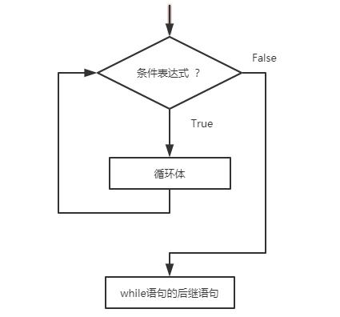

# while 循环

while循环语句格式：

​	***while(条件表达式):***

​		***循环体语句/语句块***

​	（1）计算条件表达式

​	（2）如果条件表达结果为True，控制将转到循环语句块，即进入循环体。当达到循环语句的结束点，控制转到while语句的开始，继续循环。

​	（3）如果条件表达式结果为False，退出while循环，转入到while循环语句的后继语句。

​	***while循环流程图：***



```python
number = 40

count = 0		# 声明一个计数器
while count < 3:	# 判断计数器大小
    guess_number = int(input("your guess number ?"))

    if guess_number > number:
        print("your guess bigger!")
    elif guess_number < number:
        print("your guess smaller")
    else:
        print("your get it!")
        break		
    count += 1	# 计数器自增
```

​	在这里使用了break语句，break代表跳出循环体。

​	在while循环中也可以使用else语句，用来控制循环正常结束后，而没有break，要执行的语句。

​	**语句形式：**

​	***while (条件表达式):***

​		***循环体语句块1***

​	***else:***

​		***循环体语句块2***

​	当**条件表达式**为真True，执行**循环体语句块1**；当**条件表达式**为假False，执行**else**语句中的**循环体语句块2**；如果在**循环体语句块1**中，遇到**break语句**而跳出循环，就不会执行else语句中的循环体。


```
number = 40

count = 0
while count < 3:
    guess_number = int(input("your guess number ?"))

    if guess_number > number:
        print("your guess bigger!")
    elif guess_number < number:
        print("your guess smaller")
    else:
        print("your get it!")
        break
    count += 1
else:
    print("your try too many.")
```


